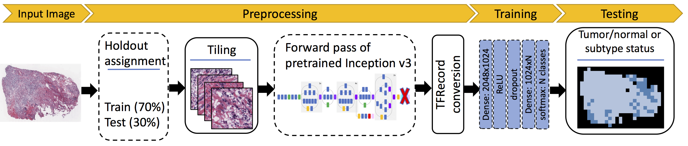

This package is an implementation of Inception-v3 CNN to classify TCGA H&E whole slide images (WSI) according to tumor/normal status and cancer subtype. It implements a pipeline in Kubernetes (k8s) under Google Cloud Platform (GCP) for labeling, tiling, and transfer learning on the images.



For details, please see the manuscript preprint:

Javad Noorbakhsh, Saman Farahmand, Mohammad Soltanieh-ha, Sandeep Namburi, Kourosh Zarringhalam, Jeff Chuang, 
*Pan-cancer classifications of tumor histological images using deep learning*, bioRxiv 715656 
https://doi.org/10.1101/715656

# Installation
To properly use the pipelines, you will need to install the package. After changing current directory to the root of the project run (for now this only works in the development mode):
```bash
pip install -e .
```

# Documentation
The Kubernetes pipelines are separated into individual apps which run the corresponding problem of interest on GCP. For details on each app refer to the README in its corresponding folder. The following apps are implemented:

- [k8s-app-tile](k8s/k8s-app-tile): tile whole slide images
- [k8s-app-createcaches](k8s/k8s-app-createcaches): apply a forward pass of tiles through pretraind CNN and store the last layer values as a text file (hereafter called 'cache')
- [k8s-app-cache-tfrecords-tn](k8s/k8s-app-cache-tfrecords-tn): create tfrecords from caches for tumor/normal classification
- [k8s-app-cache-tfrecords-subtype](k8s/k8s-app-cache-tfrecords-subtype): create tfrecords from caches for subtype classification
- [k8s-app-runcnn-tn](k8s/k8s-app-runcnn-tn): run CNN for tumor/normal classification
- [k8s-app-runcnn-subtype](k8s/k8s-app-runcnn-subtype): run CNN for subtype classification
- [k8s-app-runcnn-tn-crossclassify](k8s/k8s-app-runcnn-tn-crossclassify): test the CNNs trained on tumor/normal status for cross-classification

To begin using any of these apps you will need to [set up a k8s cluster](k8s/README.md).

# Command line tool
Few functionalities have been implemented through a command line tool. To access its help run:
```bash
histcnn --help
```

or one of the more detailed alternatives:
```bash
histcnn gcs --help
histcnn annotate --help
histcnn run-subtype --help
```
